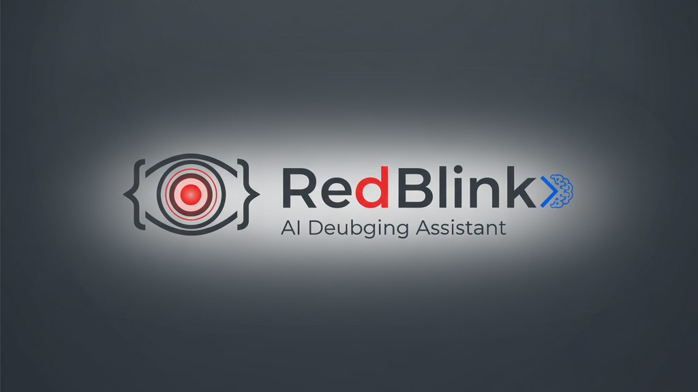

# RedBlink 🔴

**A non-intrusive AI debugging assistant for developers. Red blink. Smart questions. Any AI model.**

<<p align="center">
  
</p>

---

## 🎯 What is RedBlink?

RedBlink is an AI-powered debugging assistant that silently watches your code for errors, alerts you with a **red blinking icon**, and generates **context-aware questions** to help you debug—without interrupting your workflow.

Think of it as **Slack's @remind for debugging**: non-intrusive, contextual, and powered by the AI of your choice.

### The Problem RedBlink Solves

Developers spend **30% of their time debugging**. Current solutions are:
- **Intrusive:** ChatGPT modals, Copilot chat windows break flow state
- **Generic:** Generic answers require manual context collection (copy-paste code)
- **Locked-in:** Vendor lock-in to one AI provider (Copilot, Cursor)

RedBlink solves all three.

---

## ✨ Key Features

🔴 **Red Blink Alert System**
- Silent error detection with visual indicator
- Badge shows error count
- User controls engagement (not interrupted)

💡 **Context-Aware Questions**
- 3-4 targeted questions generated per error
- Based on YOUR actual code and error
- Ranked by relevance and urgency

🤖 **Multi-Model AI Support**
- VS Code LM API (free, built-in)
- Claude Sonnet 4.5 (user's API key)
- GPT-4o (user's API key)
- Google Gemini (free tier + user's key)
- GitHub Copilot Chat (if subscribed)
- Custom endpoints (bring your own)

🔒 **Privacy-First Architecture**
- Code stays local (never sent to RedBlink servers)
- Only sent to user-chosen AI provider
- API keys stored in OS keychain (encrypted)
- No telemetry or tracking

🌐 **Cross-Platform**
- **VS Code Extension** (Windows, macOS, Linux)
- **Browser Extension** (Chrome, Firefox, Edge, Brave)
- Same experience everywhere

🎨 **User-Friendly**
- Light & dark themes (auto-detect)
- Keyboard accessible (WCAG 2.1 AA)
- 5-minute onboarding
- Works alongside existing tools

---

## 🚀 Quick Start

### VS Code Installation (Easiest)

1. Open VS Code
2. Press `Ctrl+Shift+X` (Extensions)
3. Search **"RedBlink"**
4. Click **Install**
5. Start coding—RedBlink activates automatically

### Browser Extension Installation

**Chrome:**
1. Go to [Chrome Web Store](https://chrome.google.com/webstore)
2. Search "RedBlink"
3. Click "Add to Chrome"

**Firefox:**
1. Go to [Firefox Add-ons](https://addons.mozilla.org)
2. Search "RedBlink"
3. Click "Add to Firefox"

### 5-Minute Onboarding

```typescript
// 1. Write code with an error
const users = undefined;
const firstUser = users[0];
console.log(firstUser.name);  // ❌ ERROR!
```

```
2. See 🔴 red blink in sidebar (badge shows "1")
3. Click sidebar → see error + 4 questions
4. Click "▶️ Run in Assistant"
5. Get AI explanation
6. Apply fix
7. 🟢 Red blink stops when resolved
```

```typescript
// Done! Error fixed
const users = undefined;
const firstUser = users?.[0];  // ✅ Safe access
console.log(firstUser?.name);
```

---

## 💻 Supported Error Types

✅ **TypeScript Errors** - Type mismatches, missing properties, etc.
✅ **JavaScript Errors** - Undefined variables, null pointer exceptions
✅ **ESLint Warnings** - Code quality and best practice issues
✅ **Browser Console Errors** - Runtime exceptions, unhandled rejections
✅ **Network Failures** - 404, 500, CORS, timeout errors
✅ **Performance Warnings** - Slow functions, memory leaks

---

## 🤖 AI Model Setup

### Free (No Setup Required)
- **VS Code LM API** - Built-in, always available
- **Gemini Free Tier** - Built-in browser support

### Add Custom AI (Optional)

**To use Claude:**
1. Get API key: https://console.anthropic.com
2. RedBlink Settings → Add AI Key
3. Select "Claude Sonnet 4.5"
4. Paste key → Click "Test Connection"
5. Done!

**To use GPT-4:**
1. Get API key: https://platform.openai.com/api/keys
2. Same steps as Claude

**To use Custom Endpoint:**
1. Provide endpoint URL + Bearer token
2. RedBlink forwards questions to your endpoint
3. Works with any LLM API

---

## 📱 Screenshots

### VS Code Sidebar
```
┌──────────────────────────────┐
│ 🔴 RedBlink  ⚙️      (3)    │
├──────────────────────────────┤
│ SELECT AI MODEL              │
│ ▼ VS Code LM API (Free)      │
│   Connected ✓                │
├──────────────────────────────┤
│ ACTIVE ERRORS (3)            │
│                              │
│ ❌ TypeError                 │
│ Cannot read property 'name'  │
│ src/index.ts:42              │
│                              │
│ ⚠️  ESLint Warning           │
│ Unused variable 'config'     │
│ src/config.ts:15             │
├──────────────────────────────┤
│ QUESTIONS (3)                │
│                              │
│ 1. Why is 'data' undefined?  │
│    [▶️  Run in Assistant]     │
│                              │
│ 2. How do I check for null?  │
│    [▶️  Run in Assistant]     │
│                              │
│ 3. Should I use optional...? │
│    [▶️  Run in Assistant]     │
├──────────────────────────────┤
│ AI RESPONSE                  │
│                              │
│ The error occurs because     │
│ `users[0]` is undefined...   │
│                              │
│ Quick Fix:                   │
│ const data = users?.[0];     │
│ [📋 Copy]                    │
└──────────────────────────────┘
```

---

## 🎮 Usage Examples

### Example 1: TypeError
```typescript
const data = fetchUserData();  // Returns undefined
const name = data.user.firstName;  // ❌ ERROR!
```
**RedBlink generates:**
- "Why is 'data' undefined?"
- "How do I safely access nested objects?"
- "Should I use optional chaining?"

**AI suggests:**
```typescript
const name = data?.user?.firstName;
```

### Example 2: ESLint Warning
```typescript
function calculateTotal(items) {
  const taxRate = 0.10;  // ⚠️ Unused variable
  return items.reduce((sum, item) => sum + item.price, 0);
}
```
**RedBlink generates:**
- "Why is 'taxRate' declared but unused?"
- "How do I include tax in the calculation?"
- "When should I remove unused variables?"

### Example 3: Network Error
```
GET /api/users → 404 Not Found
```
**RedBlink generates:**
- "Why am I getting a 404 error?"
- "How do I debug API failures?"
- "What are common causes of missing endpoints?"

---

## 🔧 Configuration

### Settings (VS Code)

```json
{
  "redblink.activeProvider": "claude",
  "redblink.errorDetection.enableTypeScript": true,
  "redblink.errorDetection.enableESLint": true,
  "redblink.errorDetection.debounceMs": 500,
  "redblink.ui.theme": "auto",
  "redblink.ui.notificationsEnabled": true
}
```

### Keyboard Shortcuts

- `Ctrl+Shift+R` (Windows/Linux) or `Cmd+Shift+R` (Mac) - Toggle RedBlink sidebar
- `Ctrl+Shift+E` (Windows/Linux) or `Cmd+Shift+E` (Mac) - Focus error list

---

## 🔒 Privacy & Security

✅ **Your code never leaves your machine**
- Stays local in VS Code/browser
- Never sent to RedBlink servers
- Only sent to AI provider you choose (with your permission)

✅ **API keys encrypted**
- Stored in OS keychain (Windows Credential Manager, macOS Keychain, Linux Secret Service)
- Never logged or exposed
- Cleared after use

✅ **GDPR Compliant**
- No PII collected
- No tracking or analytics (unless opted-in)
- User controls all data sharing


---

## 📚 Documentation

- **[Getting Started](./docs/GETTING_STARTED.md)** - Installation and setup
- **[User Guide](./docs/USER_GUIDE.md)** - Features and usage
- **[API Models](./docs/API_MODELS.md)** - Setup custom AI providers
- **[Troubleshooting](./docs/TROUBLESHOOTING.md)** - Common issues
- **[Architecture](./docs/ARCHITECTURE.md)** - How RedBlink works
- **[Contributing](./CONTRIBUTING.md)** - How to contribute

---

## 🛠️ Installation from Source

### Prerequisites
- Node.js 18+
- npm or yarn
- VS Code 1.80+

### Clone & Install

```bash
# Clone repository
git clone https://github.com/RedBlink/RedBlink.git
cd RedBlink

# Install dependencies
npm install

# Development mode (VS Code extension)
npm run dev

# Build for production
npm run build

# Run tests
npm run test
```

---

## 📦 Project Structure

```
RedBlink/
├── vscode-extension/          # VS Code extension
│   ├── src/
│   │   ├── extension.ts       # Main entry point
│   │   ├── errorDetector.ts   # Error detection
│   │   ├── questionGenerator/ # Question generation
│   │   ├── aiProvider/        # AI integration
│   │   ├── ui/                # Webview (sidebar)
│   │   └── utils/             # Utilities
│   ├── package.json
│   └── tsconfig.json
│
├── browser-extension/         # Browser extension (Chrome, Firefox, Edge)
│   ├── src/
│   │   ├── background.ts
│   │   ├── content.ts
│   │   ├── popup.ts
│   │   └── shared/            # Shared code with VS Code
│   ├── manifest.json
│   └── package.json
│
├── docs/                      # Documentation
│   ├── GETTING_STARTED.md
│   ├── USER_GUIDE.md
│   ├── API_MODELS.md
│   ├── ARCHITECTURE.md
│   └── TROUBLESHOOTING.md
│
├── test/                      # Test suite
│   ├── unit/
│   ├── integration/
│   └── e2e/
│
├── LICENSE                   
├── README.md                  # This file
└── CONTRIBUTING.md            # Contribution guidelines
```

---

## 🤝 Contributing

We ❤️ contributions! Here's how to help:

### Report Bugs
- Use [GitHub Issues](https://github.com/RedBlink/RedBlink/issues)
- Include error message and steps to reproduce
- Attach screenshots if visual issue

### Suggest Features
- [Feature Requests](https://github.com/RedBlink/RedBlink/issues) with label `enhancement`
- Describe use case and benefits
- Vote on existing requests

### Submit Code
1. Fork the repository
2. Create feature branch: `git checkout -b feature/my-feature`
3. Make changes and test
4. Commit with clear messages: `git commit -m "Add feature: ..."`
5. Push to branch: `git push origin feature/my-feature`
6. Open Pull Request with description

See [CONTRIBUTING.md](./CONTRIBUTING.md) for detailed guidelines.

---

## 🐛 Troubleshooting

### RedBlink sidebar not showing?
- Reload VS Code: `Ctrl+R` (Windows/Linux) or `Cmd+R` (Mac)
- Check if extension is enabled: Extensions → RedBlink → Enable

### No errors detected?
- Save file to trigger error detection: `Ctrl+S` or `Cmd+S`
- Check if TypeScript/ESLint is installed in project
- Verify error detection is enabled in settings

### "Invalid API Key" error?
- Double-check API key from provider (copy again)
- Make sure key format is correct (e.g., "sk-..." for OpenAI)
- Test connection with "Test Connection" button
- Verify API key has necessary permissions

### Questions not showing?
- Try refreshing sidebar (focus another file, come back)
- Check that AI model is selected and connected
- Try different AI provider (use free VS Code LM API)

See [TROUBLESHOOTING.md](./docs/TROUBLESHOOTING.md) for more help.

---

## 📊 Telemetry & Analytics

**RedBlink respects your privacy:**

❌ **No telemetry** (by default)
- We don't collect usage data
- We don't track errors
- We don't send metrics

✅ **Optional analytics** (opt-in)
- Help us improve by sharing anonymous usage data
- No personal information collected
- Can be disabled anytime in settings


---

## 🌟 Acknowledgments

RedBlink is built on the shoulders of giants:
- [VS Code Extension API](https://code.visualstudio.com/api)
- [Anthropic Claude](https://www.anthropic.com/)
- [OpenAI GPT](https://openai.com/)
- [Google Gemini](https://deepmind.google/technologies/gemini/)


---

## 📞 Support & Contact

**Have questions?**

- 📖 [Documentation](./docs/)
- 🐛 [Report bugs](https://github.com/RedBlink/RedBlink/issues)
- 💬 [Discussions](https://github.com/RedBlink/RedBlink/discussions)
- 🌐 [Website](https://redblink.dev)
- 📧 Email: support@redblink.dev
- 🐦 Twitter: [@RedBlinkAI](https://twitter.com/RedBlinkAI)
- 💬 Discord: [Join Community](https://discord.gg/redblink)

---

## 🗺️ Roadmap

### v1.0 (Current) ✅
- ✅ Red blink alert system
- ✅ Context-aware questions
- ✅ Multi-model AI support
- ✅ VS Code + Browser extensions
- ✅ Secure credential storage

### v1.1 (Q1 2026)
- [ ] Question history & saved answers
- [ ] Dark theme improvements
- [ ] Performance optimizations
- [ ] More AI model integrations

### v2.0 (Q2 2026)
- [ ] Team collaboration features
- [ ] Analytics dashboard (Pro)
- [ ] IDE integrations (IntelliJ, Sublime)
- [ ] ML-powered question ranking

### v3.0+ (Future)
- [ ] Enterprise features (SSO, audit logs)
- [ ] Custom AI model training
- [ ] Mobile app
- [ ] Integration with issue trackers

---

## 🎯 Why RedBlink?

### Problem with Current Solutions

| Feature | Copilot | Cursor | ChatGPT | **RedBlink** |
|---------|---------|--------|---------|------------|
| Non-intrusive | ❌ | ❌ | ❌ | ✅ |
| Context-aware questions | ❌ | ❌ | ❌ | ✅ |
| Any AI model | ❌ | ❌ | ✅ | ✅ |
| Free tier | ❌ | ❌ | ✅ | ✅ |
| Browser support | ❌ | ❌ | ✅ | ✅ |
| Privacy-first | ⚠️ | ⚠️ | ⚠️ | ✅ |

### RedBlink is Different

🎯 **Non-intrusive** - Red blink respects your flow state
🎯 **Smart** - Questions specific to YOUR error
🎯 **Flexible** - Use any AI (free or paid)
🎯 **Private** - Code stays on your machine
🎯 **Everywhere** - VS Code + Browsers

---

## 💡 Philosophy

**RedBlink is built on three principles:**

1. **Respect Developer Flow** - Help without interrupting
2. **Empower Choice** - Use any AI, not vendor lock-in
3. **Privacy First** - Your code is yours

---

## 📈 Metrics & Impact

- **Debugging time saved:** 40-60% reduction per session
- **Flow state interruptions:** Near zero
- **Context switching:** Eliminated (integrated in IDE)
- **Learning curve:** 5 minutes
- **Setup time:** 2 minutes

---

## 🚀 Get Started Today

1. **Install:** [VS Code Marketplace](https://marketplace.visualstudio.com/items?itemName=RedBlink.redblink)
2. **Read:** [Quick Start Guide](./docs/GETTING_STARTED.md)
3. **Learn:** [User Guide](./docs/USER_GUIDE.md)
4. **Contribute:** [Contributing Guide](./CONTRIBUTING.md)
5. **Join:** [Community](https://discord.gg/redblink)

---

## 🌟 Star History

If you find RedBlink helpful, please star this repository! ⭐


---

## 📄 Latest Updates

**v1.0.0** - Upcomming
- ✨ Initial public release
- 🔴 Red blink alert system
- 💡 Context-aware questions
- 🤖 Multi-model AI support
- 🌐 VS Code + Browser extensions

---

## 🙏 Thank You

Thank you for checking out RedBlink! We hope it makes your debugging experience better.

**Built with ❤️ by developers, for developers.**

---

**Ready to debug smarter?** [Install RedBlink now →](https://marketplace.visualstudio.com/items?itemName=RedBlink.redblink)
